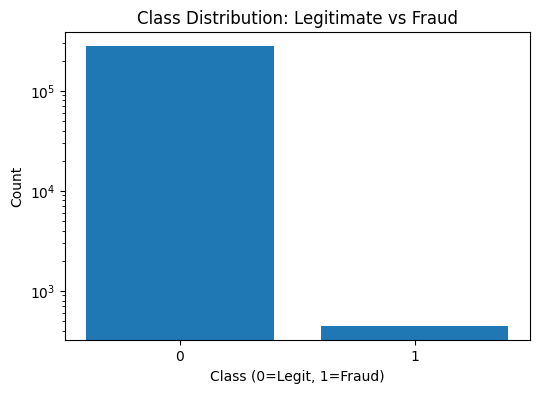
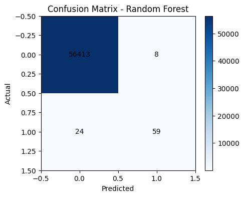

# Credit Card Fraud Detection - Databricks ML Pipeline

An end-to-end fraud detection pipeline built in Databricks using PySpark and Delta Live Tables, covering data ingestion, cleaning, and binary classification on the classic Kaggle credit card fraud dataset.

## Dataset

[Credit Card Fraud Detection (Kaggle)](https://www.kaggle.com/mlg-ulb/creditcardfraud) — 284,807 anonymized European card transactions from September 2013, with 492 confirmed fraud cases (~0.17% of transactions). Features V1–V28 are PCA-transformed for confidentiality, alongside `Time`, `Amount`, and the `Class` label (0 = legitimate, 1 = fraud).

## Pipeline

**01_fraud_ingest** — Reads the raw CSV into a Spark DataFrame and writes it to a `raw_transactions` Delta table.

**02_fraud_transform** — Runs data quality checks (invalid amounts, nulls, duplicates) and cleans the dataset:
- Removed 1,825 rows with invalid (≤0) amounts
- Removed 1,081 duplicate rows
- 0 rows with missing critical fields
- Result: 284,807 → 281,918 clean rows, written to `clean_transactions`

**03_fraud_model** — Assembles features with `VectorAssembler`, splits into an 80/20 train/test set (225,414 / 56,504 rows), and trains a **Logistic Regression** baseline.

**04_fraud_model_comparison** — Trains a **Random Forest** classifier (100 trees) on the same split and compares performance against the baseline.

A **Delta Live Tables pipeline** (`fraud_pipeline`) also orchestrates the ingestion and cleaning stages as materialized views (`raw_transactions_dlt` → `clean_transactions_dlt`), following the Medallion Architecture.

## Why Precision & Recall Over Accuracy

With only 0.17% of transactions being fraudulent, a model that predicts "not fraud" for everything would score 99.83% accuracy while catching zero fraud. Precision and recall on the fraud class are the metrics that actually matter here — precision tells us how many fraud alerts are real, recall tells us how much fraud we're catching.

## Model Comparison

| Model | Accuracy | Fraud Precision | Fraud Recall |
|---|---|---|---|
| Logistic Regression | 99.93% | 90.9% | 60.2% |
| **Random Forest** | **99.94%** | 88.1% | **71.1%** |

**Selected model: Random Forest.** While Logistic Regression edges out slightly on precision, Random Forest catches significantly more fraud cases (71.1% vs 60.2% recall) with only a small drop in precision — a stronger tradeoff for a fraud detection use case, where missing fraud is typically costlier than an occasional false alarm.

Out of 56,504 test transactions, Random Forest correctly identified 59 of 83 actual fraud cases, with only 8 false positives out of over 56,000 legitimate transactions.

## Tech stack
`python` `pyspark` `databricks` `delta-live-tables` `machine-learning` `medallion-architecture` `logistic-regression` `random-forest`

## Next steps
- Experiment with class balancing techniques (SMOTE, class weighting) to further improve fraud detection coverage
- Try XGBoost for comparison
- Add ROC curve and precision-recall curve visualization for threshold tuning
